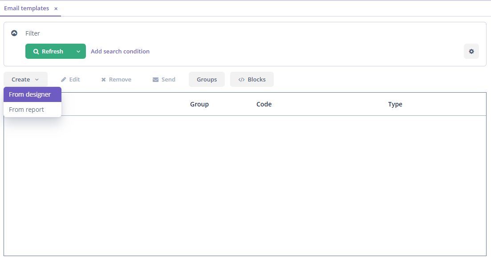
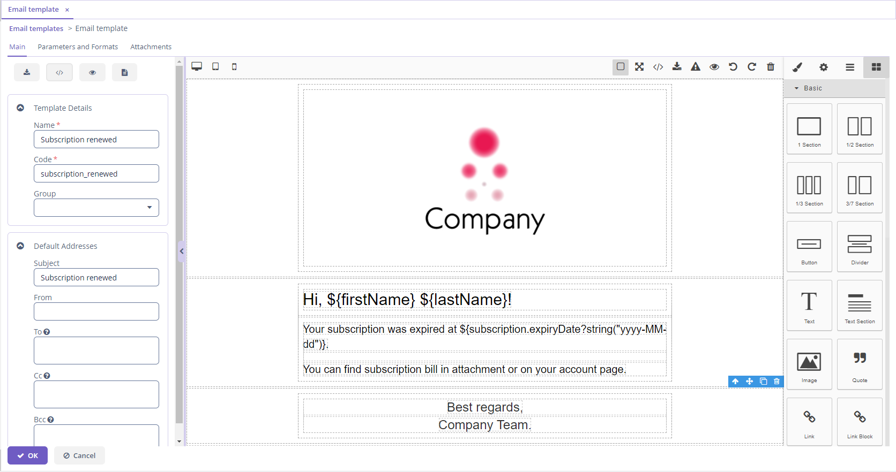
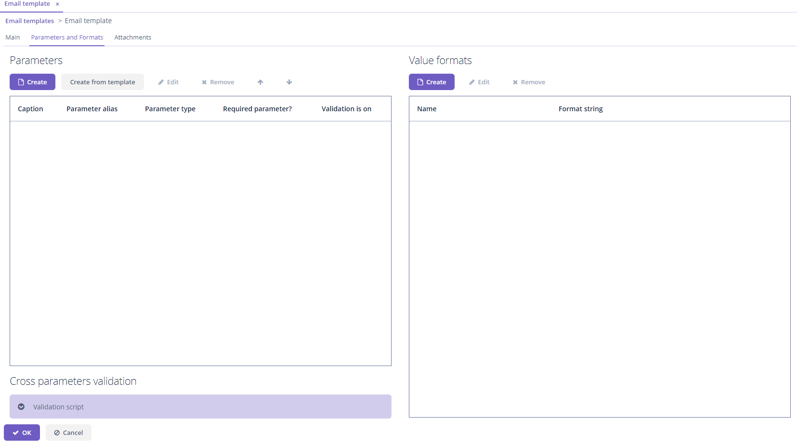
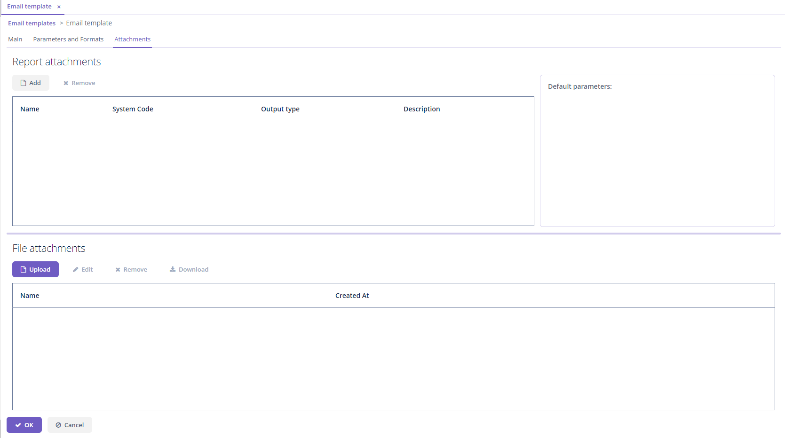
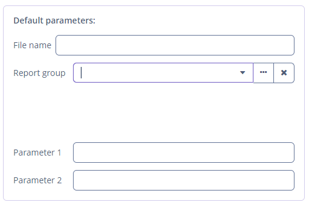
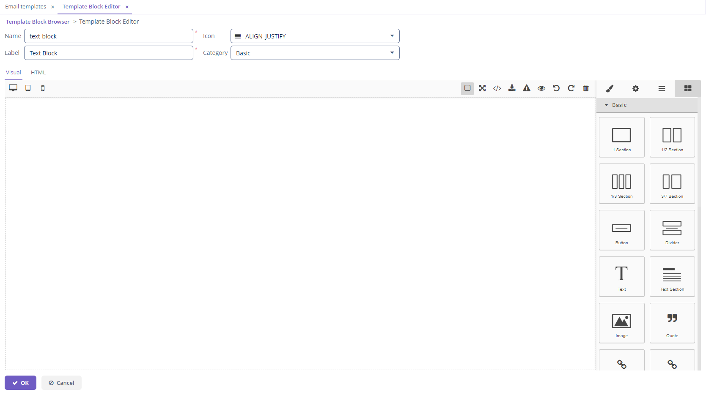
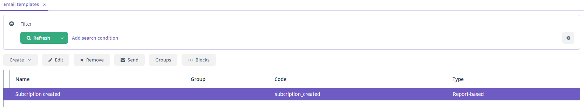
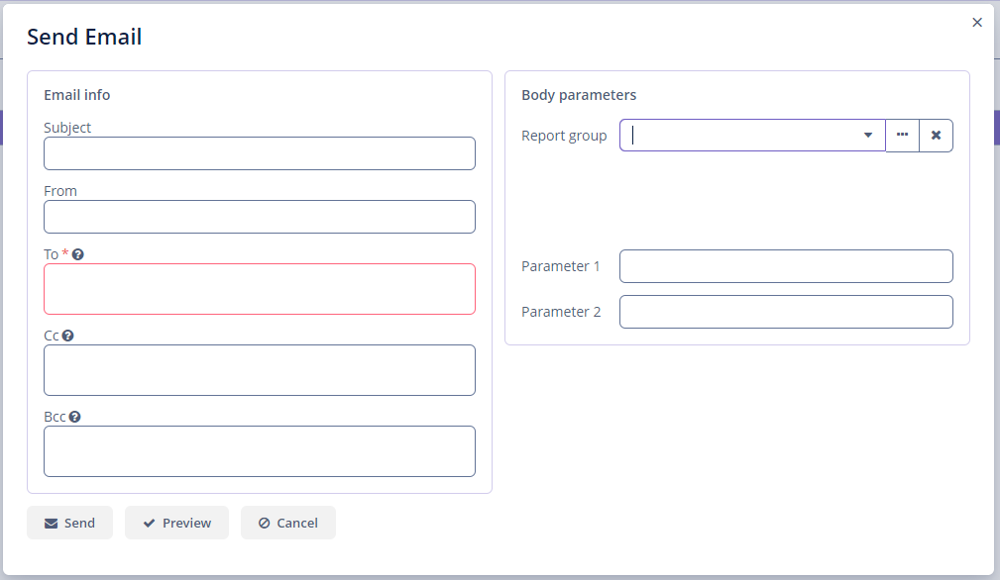

# Jmix Email Templates

**CAUTION: The project is in EXPERIMENTAL status and may be removed or modified in any way without notice. Use at your own risk!**

- [1. Overview](#Overview)
- [2. Installation](#installation)
- [3. Usage](#usage)  
  - [3.1. Creating Email Templates](#creating-email-templates)  
    - [3.1.1. Creating Email Template From Report](#creating-from-report)  
    - [3.1.2. Creating Email Template From Designer](#creating-from-designer)  
    - [3.1.3. Setting attachments](#setting-attachments)
  - [3.2. Setting Groups](#setting-groups)
  - [3.3. Custom Blocks](#custom-blocks)  
  - [3.4. Sending Emails](#sending-emails)  
- [4. Email Templates API](#api)  
  - [4.1 Email Templates Builder](#builder)
- [5. Predefined Roles](#roles)

# 1. Overview <a name="Overview"></a>

The add-on enables creating and configuring outbound email templates containing a constant body and variable parameters. A template is created in the visual HTML designer or by using reports. The add-on provides a visual HTML editor with the extensive set of HTML elements.

Sending emails from templates can be set as a reaction to different events in your application. You can preset recipients, configure parameters and upload attachment files to be sent with emails.

Key features:
- Visual HTML templates builder based on [GrapesJS](https://grapesjs.com/) JavaScript library.
- HTML reports as a base for outbound emails body.
- Downloading/uploading HTML code of a template.
- User interface for configuring and managing templates.


# 2. Installation <a name="installation"></a>

The add-on can be added to your project by adding the following dependencies:
```groovy
implementation 'io.jmix.emailtemplates:jmix-emailtemplates-starter'
implementation 'io.jmix.emailtemplates:jmix-emailtemplates-ui-starter'
```

# 3. Usage <a name="usage"></a>

You can use the following component features.

## 3.1. Creating email templates <a name="creating-email-templates"></a>

The component enables you to create, edit and remove email templates.

To open *Email template browser* press *Email templates* in the *Administration* menu.

There are two ways to create email template: from report and from designer.



### 3.1.1. Creating Email Template From Report <a name="creating-from-report"></a>

The following parameters are available for editing:

- the *Name* field;
- the *Code* field;
- the *Group* drop-down;
- the *Use subject from report* checkbox;
- the *Subject* field (if *Use subject from report* unchecked);
- the *From* field;
- the *To* field;
- the *Cc* field;
- the *Bcc* field;
- the *Report template to generate body* lookup field.


If the report type is a report with an entity you can set entity for a template. In addition, you can set report parameters.


If the report type is a report with entities you can set entities for a template. In addition, you can set report parameters.


### 3.1.2. Creating Email Template From Designer <a name="creating-from-designer"></a>

The following parameters are available for editing:

- the *Name* field;
- the *Code* field;
- the *Group* drop-down;
- the *Subject* field;
- the *From* field;
- the *To* field;
- the *Cc* field;
- the *Bcc* field.

The screen contains the following elements:

- the *Import HTML* button;
- the *HTML code* button;
- the *View HTML* button;
- the *Export Report* button;
- the *HTML Editor*.

This type of creating template provides the ability to use HTML editor. You can design a template with different elements and set every element,  using *Setting* panel.

See more information about using the editor in `README` [for GrapesJs HTML editor](https://github.com/cuba-platform/grapesjs-addon/blob/master/README.md).



To add parameters and value formats go to the *Parameters and Formats* tab.



To create parameters automatically from template use *Create from template* button in the *Parameters* section.


### 3.1.3. Setting attachments <a name="setting-attachments"></a>
You can add or remove attachments on the *Attachments* tab for both types of templates: from report and from designer. You can attach a report or a file.



You can set the following parameters for a report attachment:

- *File name* - a report attachment name for an addressee;
- an entity or entities for a report;
- parameters from a report.



## 3.2. Setting Groups <a name="setting-groups"></a>

To open group browser click *Groups* in the *Email templates* browser. The screen enables you to create, edit or remove email template groups.


To create or edit the group enter the name of the group.


After setting groups, you can specify a group for a template.

## 3.3. Custom Blocks <a name="custom-blocks"></a>

The add-on enables creating custom blocks. Go *Administration -> Email templates* and click the *Blocks* button.

To create a new block click the *Create* button and in the *Template Block editor* screen you can move predefined HTML elements and change them on the canvas. Or you can see and set HTML code on the *HTML* tab.



You can put the created custom block to the predefined groups or create your own. Go *Administration -> Email templates* and click the *Blocks* button and then *Groups* button.

Your created custom HTML elements will appear in the *Email template* editing screen while creating an email template from designer.


## 3.4. Sending Emails <a name="sending-emails"></a>

To send an email select a template in the list and click *Send*.



The following parameters are available for editing:

- the *Subject* field;
- the *From* field;
- the *To* field;
- the *Cc* field;
- the *Bcc* field.

The *To* field is required. You can select entity or entities for the report and set report parameter.



# 4. Email Templates API <a name="api"></a>

A developer can use the following methods from EmailTemplates:

1. To create EmailInfo from a template that may contain the same reports with different parameter values:
```java
    EmailInfo generateEmail(EmailTemplate emailTemplate, List<ReportWithParams> params)
```
2. To create EmailInfo by parameters map for all included reports:
```java
    EmailInfo generateEmail(EmailTemplate emailTemplate, Map<String, Object> params)
```
3. To check that the report input parameter did not change its parameter type:
```java
    void checkParameterTypeChanged(ReportInputParameter inputParameter, ParameterValue parameterValue)
```

The `EmailTemplate` entity contains subject, body, and attachments. It also contains from, to, cc, bcc addresses.

The `ReportWithParams` is a wrapper class that represents a report and a map of parameters for that report.

The `ParameterValue` is a class that provides a string representation of the parameter with alias and type.

The `ReportInputParameter` is a class of Reporting component.

The `EmailInfo` is a class of Jmix `Email Add-on`.

## 4.1. Email Templates Builder <a name="builder"></a>

Email templates API contains builder that can create and fill `EmailTemplate` entity.

`EmailTemplateBuilderImpl` is an implementation of `EmailTemplateBuilder` that provides intermediate methods for
setting and adding email template properties. It also contains terminal methods that can build `EmailTemplate`,
generate or send `EmailInfo`.

A copy of the specified `EmailTemplate` is created in the corresponding setter in the ```EmailTemplateBuilderImpl``` class. Every intermediate method fills the created copy.
```java
    public void setEmailTemplate(EmailTemplate emailTemplate) {
        this.emailTemplate = cloneTemplate(emailTemplate);
        }
```
The `build()` method creates the copy from the copy inside builder. It is necessary to save a state of the existed entity or builder.

Example of using the builder:
```java
    EmailTemplate newTemplate = emailTemplates.buildFromTemplate(emailTemplate)
            .setSubject("Test subject")
            .setTo("address@haulmont.com")
            .setBodyParameter("entity", someEntity)
            .setAttachmentParameters(reportsWithParams)
            .build();
```

# 5. Predefined Roles <a name="roles"></a>
- **email-templates-core-admin** - grants access to all Email templates entities.
- **email-templates-admin** - grants access to all Email templates screens and entities.
- **email-templates-can-send-templates-core** - grants read access to the Email templates entities required to send created email templates as emails.
- **email-templates-can-send-templates** - allows user to send created email templates as emails.
