# Dashboards

- [Overview](#overview)
- [Installation](#installation)
- [Configuration](#configuration)
    - [Extending Application Theme](#extending-application-theme)
    - [Adding Widget Types](#adding-widget-types)
- [Usage](#usage)
- [Dashboards](#dashboards)
    - [Dashboard Fields](#dashboard-fields)
    - [Dashboard Parameters](#dashboards-parameters)
    - [Palette](#palette)
        - [Widgets](#widgets)
        - [Layouts](#layouts)
        - [Templates](#templates)
    - [Canvas](#canvas)
    - [Dashboard Layout Structure](#dashboard-layout-structure)
    - [Buttons Panel](#buttons-panel)
- [Dashboard Groups](#dashboard-groups)
- [Widget Templates](#widget-templates)
- [Widget Template Editor](#widget-template-editor)
- [Parameter Editor](#parameter-editor)
- [Integration of the Component Dashboard-UI](#integration-of-the-dashboard-ui-component)
    - [Loading a dashboard from JSON file](#loading-a-dashboard-from-json-file)
- [Predefined Roles](#predefined-roles)

# 1. Overview <a name="overview"></a>

This component enables creating and embedding dashboards into your application screens. Dashboards allow visualizing
summarized information, data sets, charts and can be accessible only by authorized users.

A dashboard consists of widgets — individual elements based on a fragment. An integrated set of layouts allows positioning
widgets on a dashboard according to your needs. Use responsive layouts to adapt your dashboards to different displays.

# 2. Installation <a name="installation"></a>

The add-on can be added to your project using dependencies :

```groovy
    implementation 'io.jmix.dashboards:jmix-dashboards-starter'
    implementation 'io.jmix.dashboards:jmix-dashboards-ui-starter'
```

# 3.Configuration <a name="configuration"></a>

Before starting working with dashboard editor in your application you should do some configuration setting: extend
application theme and add widgets.

## 3.1. Extending Application Theme <a name="extending-application-theme"></a>

Because of Dashboards add-on uses additional styles for the components it is required to use a custom theme in the project instead of a compiled theme.

If a custom theme is not used in the project, it is required to create the new one. The new theme will extend one of the existing themes.

A custom theme can be created and configured using the following rules:
1. Theme must have a unique name.
2. Theme and all its resources should be located in the folder: ```src/main/themes/<theme-name>```.
   This folder should contain ```styles.scss``` file which represents the entry point to compile the theme. <br/>
   Example of ```styles.scss``` file for the theme with the name ```custom-name```:
```
        @import "custom-theme-defaults";
        @import "addons";
        @import "custom-theme";
        
        .custom-theme {
          @include addons;
          @include custom-theme;
        }     
```        
Here ```addons``` is a special file that is generated automatically based on used addons and themes.
3. Add ```<theme-name>-theme.properties``` file in project resources.

4. Specify theme name and path to ```<theme-name>-theme.properties``` file in ```application.properties```.<br/>
   Example for the theme with the name ```custom-theme```:
```
jmix.ui.theme = custom-theme
jmix.ui.themeConfig=com/company/sample/theme/custom-theme-theme.properties
```

After the theme is added and configured, add the following dependencies in ```build.gradle```:
```
dependencies {
    //...
    themes 'io.jmix.ui:jmix-ui-themes'
    themes 'io.jmix.dashboards:jmix-dashboards-ui'
    //...
}
```

## 3.2. Adding Widget Types <a name='adding-widget-types'></a>

By default, the add-on does not have preset widgets. To create an additional widget type, you need to do the following:

1. Create a fragment as described.
2. Add the annotation `io.jmix.dashboardsui.annotation.DashboardWidget`. Fill in the fields: `name`, `editFragmentId`(
   optional, leave empty if there is no parameter in the widget) in the annotation (see JavaDoc).
3. `widget`, `dashboardModel`, `dashboard` can be included in the widget via `@WindowParam` annotation. Widget
   parameters in widget editor and widget fragments should have `@WidgetParam` and `@WindowParam` annotations. For
   example:

```java

@DashboardWidget(name = CAPTION, editFragmentId = "dshbrd_LookupWidget.edit")
@UiController("dshbrd_LookupWidget")
@UiDescriptor("lookup-widget.xml")
public class LookupWidget extends ScreenFragment implements RefreshableWidget {
    public static final String CAPTION = "Lookup";

    @WindowParam
    protected Widget widget;

    @WindowParam
    protected DashboardModel dashboardModel;

    @WindowParam
    protected Dashboard dashboard;

    @WidgetParam
    @WindowParam
    protected String lookupWindowId;

    public String getLookupWindowId() {
        return lookupWindowId;
    }

    public void setLookupWindowId(String lookupWindowId) {
        this.lookupWindowId = lookupWindowId;
    }

    @Override
    public void refresh(DashboardEvent dashboardEvent) {
        //some actions
    }
}
```

4. Add the fragment for editing widget. For example:

```xml
<?xml version="1.0" encoding="UTF-8" standalone="no"?>
<fragment xmlns="http://jmix.io/schema/ui/fragment">
    <layout spacing="true">
        <hbox id="lookupIdBox"
              spacing="true">
            <label width="85px"
                   value="msg://lookupId"/>
            <comboBox id="lookupIdComboBox"
                      nullOptionVisible="false"
                      required="true"/>
        </hbox>
    </layout>
</fragment>
```

```java

@UiController("dshbrd_LookupWidget.edit")
@UiDescriptor("lookup-widget-edit.xml")
public class LookupWidgetEdit extends ScreenFragment {
    @Autowired
    protected ComboBox<String> lookupIdComboBox;
    @Autowired
    protected WindowConfig windowConfig;
    @Autowired
    protected Metadata metadata;
    @Autowired
    protected ScreenXmlLoader screenXmlLoader;

    protected InstanceContainer<Widget> widgetDc;

    @WidgetParam
    @WindowParam
    protected String lookupWindowId;

    @Subscribe
    public void onInit(InitEvent event) {
        ScreenOptions options = event.getOptions();
        Map<String, Object> params = Collections.emptyMap();
        if (options instanceof MapScreenOptions) {
            params = ((MapScreenOptions) options).getParams();
        }
        lookupIdComboBox.setOptionsList(getAllLookupIds());
        lookupIdComboBox.addValueChangeListener(e -> lookupIdSelected(e.getValue()));

        initWidgetDс(params);
        selectLookupId();
    }

    protected void initWidgetDс(Map<String, Object> params) {
        widgetDc = (InstanceContainer<Widget>) params.get(WidgetEdit.ITEM_DC);
    }
}
```

If widget fragment implements `RefreshableWidget` interface, then method `refresh()` will be invoked automatically on
each dashboard update event.

# 4. Usage <a name="usage"></a>

After installation the add-on in your project the *Dashboard* menu will appear containing *Dashboards* and *Widget
templates* screens.

## 4.1. Dashboards <a name='dashboards'></a>

*Dashboard browser* contains the list of dashboards and buttons for creating, editing and removing dashboards in a
database.

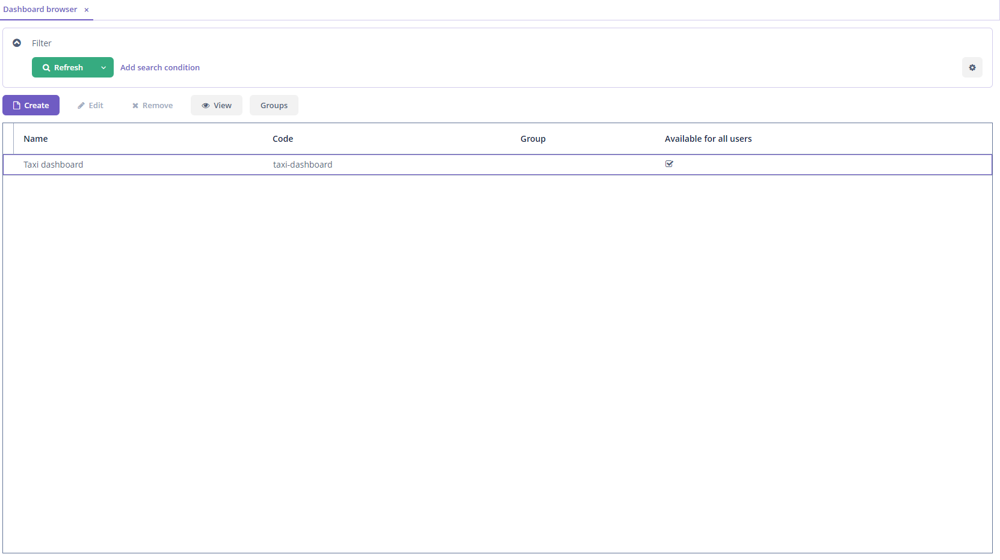

*Dashboard editor* screen appears after clicking the *Create* button on the *Dashboards* screen and allows editing a
dashboard.

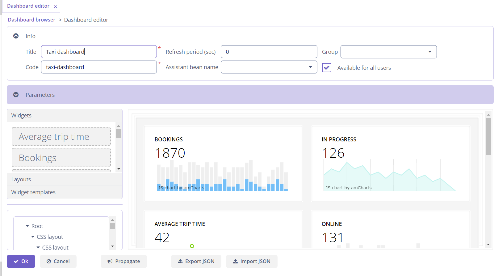

*Dashboard editor* screen contains 6 areas:

- the dashboard fields;
- the dashboard parameters;
- the palette with widgets and layouts;
- the canvas where the position of dashboard elements (widgets and layouts) is specified;
- the tree representation of the edited dashboard structure;
- the buttons panel.

### 4.1.1 Dashboard Fields <a name='dashboard-fields'></a>

To save the created dashboard it is necessary to fill in at least the required fields:

- *Title* - a name of the dashboard.
- *Code* - a unique identifier for a more convenient search in a database.

The following fields are available to set:

- *Refresh period (sec)* - a time period in seconds for the refresh a dashboard UI.
- *Assistant bean name* - an optional reference to a Spring bean class that should be used for customizing the
  dashboard (assistance bean must have `prototype` bean scope).
- *Group* - a dashboard group.
- *Available for all users* - a flag which defines the user access to the dashboard. If set to `false`, then only the
  user who created the dashboard can view and edit it. Otherwise, all users can view and edit the dashboard.

### 4.1.2 Dashboard Parameters <a name='dashboards-parameters'></a>

The fragment with dashboard parameters which allows adding, editing and removing dashboard parameters. These parameters
are passed as input parameters for the widgets in this dashboard. For more information on adding and editing parameters,
see [Parameter Editor](#parameter-editor).

### 4.1.3 Palette <a name='palette'></a>

It is a container with 3 collapsible tabs. Each tab contains a container with components. When a component is dragged to
the canvas, the corresponding element will be added to the canvas.

#### 4.1.3.1 Widgets <a name='widgets'></a>

By default, there are no widgets in this tab. You can add widgets as described
in [Adding Widget Types](#adding-widget-types) section. Drag an element from the palette for adding it on the canvas,
and the widget editor will be opened in a dialog window. It is possible to make the widget a template (in this case, it
is added to the tab *Widget Templates*).

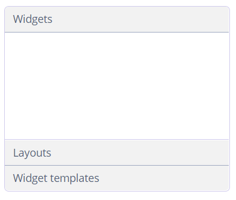

#### 4.1.3.2 Layouts <a name='layouts'></a>

Layouts help to place widgets in the specific way. Add the required layout before adding widgets on the canvas.

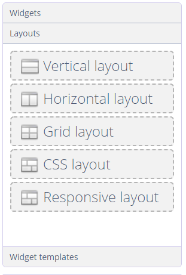

The following layouts are available:

- **vertical** - widgets are placed vertically one after another;
- **horizontal** - widgets are placed horizontally one after another;
- **grid** - widgets are placed inside a grid with a specified number of rows and columns;
- **css** - enables full control over placement and styling of enclosed components using CSS;
- **responsive** - widgets are placed vertically, but depending on the screen width, the number of columns with widgets
  changes. After adding this layout on the canvas the setting form will appear. The slider shows which part of the
  screen will be occupied by one widget when opening the dashboard on a particular device.

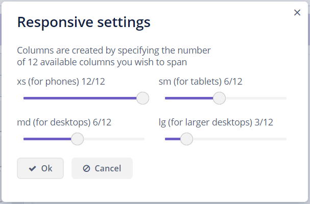

#### 4.1.3.3. Templates <a name='templates'></a>

Contains widget templates from a database. Templates can be created from the widgets added on the canvas using the
corresponding button, or by using [Widget Template Browser](#widget-template-browser).


### 4.1.4 Canvas <a name='canvas'></a>

It is a container in which you can place widgets and layouts. Drag an element from the palette for adding it on the
canvas.

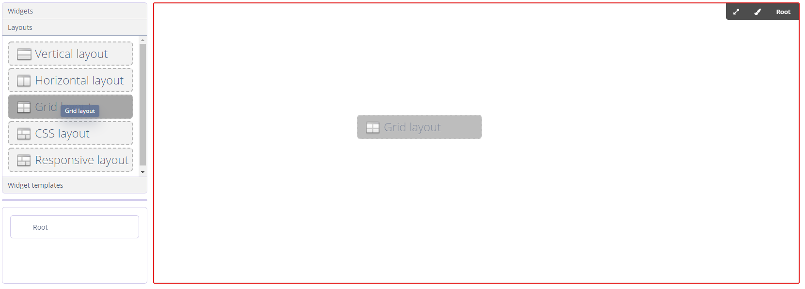

When dragging the *Grid Layout* to the canvas the dialog will open where you can set the number of rows and columns.
When dragging a widget, the *Widget editor* dialog will open. When dragging the *Responsive Layout* the dialog with
settings will open.

Example of the dashboard with widgets:

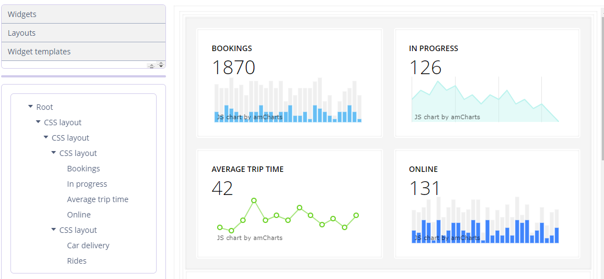

Click on a layout or a widget to select it. The selected element contains the panel with the following buttons:


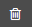 - deletes a container from the canvas.

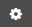 - opens the *Widget editor*.

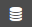 - opens the *Widget template editor*.

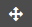 - changes the weight (expand ratio) of a container in a parent container, or define `colspan`
and `rowspan` attributes for the grid layout cells:

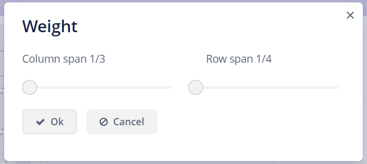

 - changes the style of a container: define the style name, modify the container's width and
height:


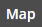 - displays the element name specified by user.

### 4.1.5. Dashboard Layout Structure <a name='dashboard-layout-structure'></a>

Displays the current dashboard structure as a tree. The *Root* element is available by default and cannot be removed.


The following actions are available for the tree elements from the context menu:

- **Expand** - defines a component within a container that should be expanded to use all available space in the
  direction of component placement. For a container with vertical placement, this attribute sets 100% height to a
  component; for the containers with horizontal placement - 100% width. Additionally, resizing a container will resize
  the expanded component.
- **Style** - enables setting a style name and modifying the component's height and width.
- **Remove** - removes a component from the tree.
- **Weight** - changes the weight (expand ratio) of a container in a parent container.
- **Edit** - opens the widget editor.
- **Template** - opens the widget template editor.

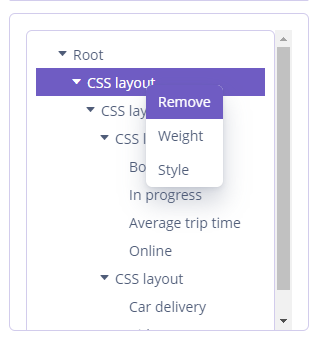 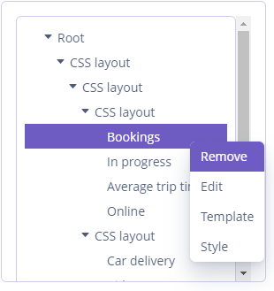

### 4.1.6. Buttons Panel <a name='buttons-panel'></a>

This panel contains the following buttons:

- *OK* - saves the dashboard and close the editor.
- *Cancel* - closes the editor without saving the dashboard.
- *Propagate* - publishes event `io.jmix.dashboardsui.event.DashboardUpdatedEvent`.
- *Export JSON* - export the dashboard to a JSON file.
- *Import JSON* - import the dashboard from a JSON file and refresh the editor.

## 4.2 Dashboard Groups <a name='dashboard-groups'></a>

The screen *Dashboard groups* allows creating, editing, and removing dashboard groups. The screen *Dashboard group
editor* allows adding or excluding dashboards in a dashboard group from a database.

To open the *Dashboard groups* browser, click the *Groups* button in the *Dashboard browser* screen.

## 4.3. Widget Templates <a name="widget-templates"></a>

This screen allows creating, editing and removing widget templates. Widget templates are preconfigured widgets which can
be reused. Widget templates are stored in a database. This screen is available from the application menu.

### 4.3.1 Widget Template Editor <a name="widget-template-editor"></a>

This screen allows editing a widget and consists of the following elements:

- the *Name* field;
- the *Group* drop-down;
- the *Widget type* lookup field;
- the *Customize* button;
- the checkbox to set the widget visibility.

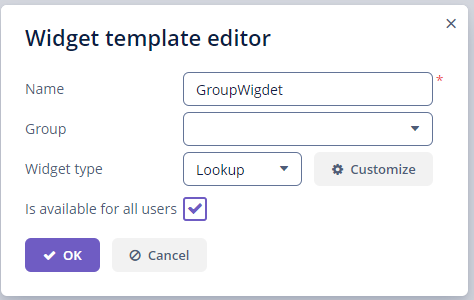

When a user clicks the *Customize* button, the enhanced widget editor will be opened, consisting of the following
elements:

- the *Caption* field;
- the *Widget Id* field;
- the *Description* field;
- the *Show widget caption* checkbox;
- the *Widget* group, that contains a fragment specified in the```editFragmentId``` field in the ```@DashboardWidget``` annotation.
- the fragment with widget parameters which allows adding, editing and removing widget parameters. These parameters are
  passed as input parameters for the fragment, based on which the widget was taken. For more information on adding and
  editing parameters, see [Parameter Editor](#parameter-editor).

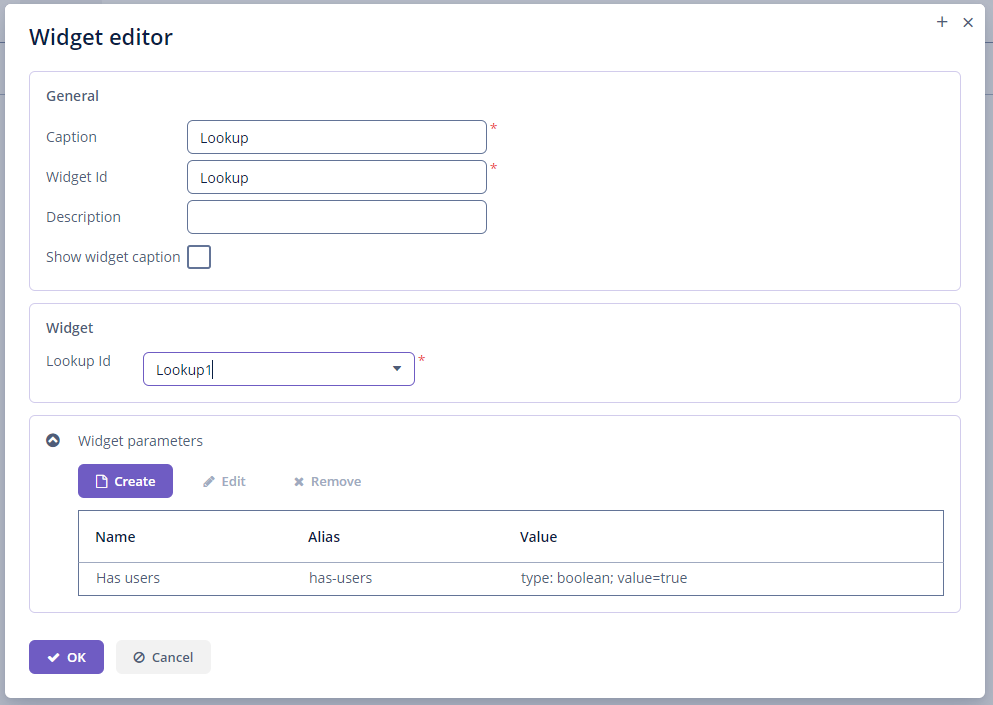

### 4.3.2 Parameter Editor <a name='parameter-editor'></a>

This screen allows editing parameters. A parameter is a key-value pair, where the *Name* field is the key and the *
Value* field is a value. The following types of values are available:

- ENTITY
- ENTITY_LIST
- ENUM
- DATE
- DATETIME
- TIME
- UUID
- INTEGER
- STRING
- DECIMAL
- BOOLEAN
- LONG


## 4.4. Integration of the Dashboard-UI Component <a name='integration-of-the-dashboard-ui-component'></a>

To use the `dashboard` component in your screen, you need to add the special
scheme `http://jmix.io/schema/dashboards/ui` in the XML descriptor of the screen.    
Then add a namespace like `dashboard` for the schema. The schema contains information about the tag `dashboard`, which
can contain the `parameter` elements.

Here is an example of adding dashboard to the screen:

```xml
 <?xml version="1.0" encoding="UTF-8" standalone="no"?>
<window xmlns="http://jmix.io/schema/ui/window"
        caption="msg://caption"
        xmlns:dashboard="http://jmix.io/schema/dashboards/ui">
    ...
    <dashboard:dashboard id="dashboardId"
                         code="usersDashboard"
                         timerDelay="60">
        <dashboard:parameter name="role" value="Admin" type="string"/>
    </dashboard:dashboard>
    ...
```

Dashboard tag contains the following attributes:

- `code` - the attribute which will serve for a dashboard search in a database;
- `jsonPath` - the `classPath` to the dashboard JSON file;
- `timerDelay` - the time period in seconds for refresh a dashboard-ui.
- `assistantBeanName` - an optional reference to a Spring bean class that should be used for customizing the
  dashboard (assistance bean must have `prototype` bean scope).

**Note:** when embedding a dashboard, you must specify the `code` or `jsonPath` attribute. When specifying at the same
time, the attribute `code` takes precedence over `jsonPath`.

Dashboard parameter tag has the following attributes:

- `name` - the name of the parameter, required;
- `value` - the value of the parameter, required;
- `type` - the type of the value, required. Can take one of the following values: boolean, date, dateTime, decimal, int, long,
  string, time, uuid. Type is required.

### 4.4.1. Loading a dashboard from JSON file <a name='loading-a-dashboard-from-json-file'></a>

You can load a dashboard to the screen from JSON file. Use `jsonPath` attribute and set the relative path to the file in
the XML descriptor. For example:

```xml

<dashboard:dashboard id="dashboardId"
                     jsonPath="/com/company/dashboards/Users Dashboard.json"
                     timerDelay="60">
    <dashboard:parameter name="role" value="Admin" type="string"/>
</dashboard:dashboard>
        ...
```

A dashboard created in the *Dashboard editor* screen can be exported into JSON file, just click the *Export JSON* button
and specify the path to the file.

Also, you can import a dashboard from the file in the *Dashboard editor* screen, just click the *Import JSON* button,
enter the path to the file, specify the unique code and click *OK* to save a dashboard.

## 4.5. Predefined roles <a name='predefined-roles'></a>

Predefined security roles:

- **dashboards-admin**, **dashboards-admin-ui** - allows user to create and edit dashboards and widget templates.
- **dashboards-view**, **dashboards-view-ui** - allows user to see embedded dashboards.
- **dashboards-browse**, **dashboards-browse-ui** - allows user to view a list of available dashboards.
