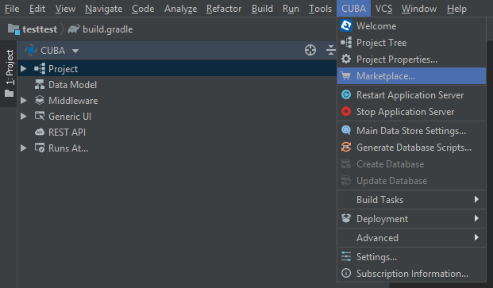
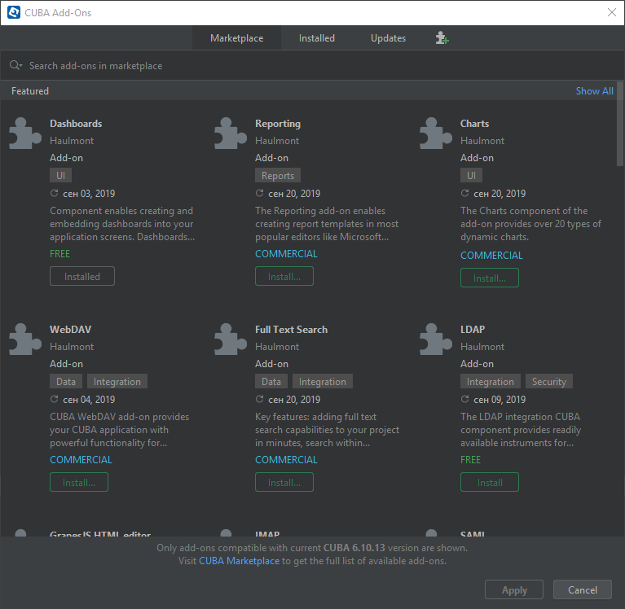
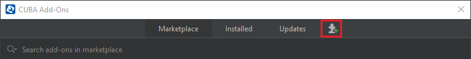
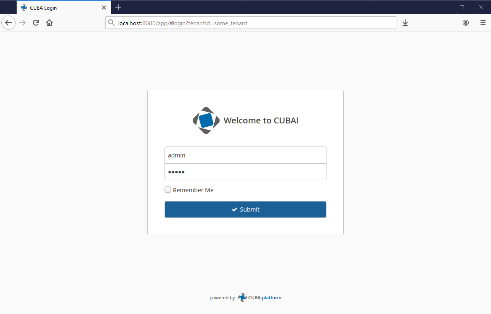

    
    

# Multitenancy

- [Overview](#overview)
- [Installation](#installation)
    - [From the Marketplace](#from-the-marketplace)
    - [By Coordinates](#by-coordinates)
- [Setting](#setting)
- [Predefined Roles](#predefined-roles)
- [Components Compatibility](#components-compatibility)
- [Managing Tenants](#managing-tenants)
- [Tenant Permissions](#tenant-permissions)
- [Authorization using the URL parameter](#authorization-using-the-url-parameter)
- [Migration](#migration)
- [Common and Tenant-Specific Data](#common-and-tenant-specific-data)
    - [Common Data](#common-data)
    - [Tenant-Specific Data](#tenant-specific-data)
- [Appendix A. Multitenancy API](#appendix-a-multitenancy-api)
- [Appendix B. Application Properties](#appendix-b-application-properties)

# Overview

The component implements a single database multitenancy support for CUBA applications.

It enables using a single application instance to serve multiple tenants - groups of users that are invisible to each
other and do not share any data they have write access to.

The component supports two types of data:

* common data - shared across tenants. Tenants have read-only access to this type of data;
* tenant-specific data - not accessible to other tenants. Tenants have full access to this type of data.

All tenants have their own admin users which can create tenant users and assign tenant-specific roles and permissions.

See [sample application](https://github.com/cuba-platform/multitenancy-addon-demo), using this component.

# Installation

The add-on can be added to your project in one of the ways described below. Installation from the Marketplace is the
simplest way. The last version of the add-on compatible with the used version of the platform will be installed. Also,
you can install the add-on by coordinates choosing the required version of the add-on from the table.

In case you want to install the add-on by manual editing or by building from sources see the complete add-ons
installation guide
in [CUBA Platform documentation](https://doc.cuba-platform.com/manual-latest/manual.html#app_components_usage).

## From the Marketplace

1. Open your application in CUBA Studio. Check the latest version of CUBA Studio on
   the [CUBA Platform site](https://www.cuba-platform.com/download/previous-studio/).
2. Go to *CUBA -> Marketplace* in the main menu.

3. Find the Multitenancy add-on there.

4. Click *Install* and apply the changes. The add-on corresponding to the used platform version will be installed.

## By coordinates

1. Open your application in CUBA Studio. Check the latest version of CUBA Studio on
   the [CUBA Platform site](https://www.cuba-platform.com/download/previous-studio/).
2. Go to *CUBA -> Marketplace* in the main menu.
3. Click the icon in the upper-right corner.

4. Paste the add-on coordinates in the corresponding field as follows:

`com.haulmont.addon.sdbmt:sdbmt-global:<add-on version>`

where `<add-on version>` is compatible with the used version of the CUBA platform.

| Platform Version| Add-on Version |
|------------------|----------------|
| 7.2.x            | 2.0.0          |
| 7.1.x            | 1.4.0          |
| 7.0.x            | 1.3.2          |
| 6.10.x           | 1.2.1          |
| 6.9.x            | 1.1.1          |
| 6.8.x            | 1.0.0          |

5. Click *Install* and apply the changes. The add-on will be installed to your project.

# Setting

Tenant-specific tables must have an additional column `TENANT_ID` to specify the owner of the data. Note, that the
following standard CUBA entities already have an additional column `SYS_TENANT_ID` to support multitenancy:

* FileDescriptor
* ScheduledTask
* ScheduledExecution
* Role
* Group
* GroupHierarchy
* User
* Constraint
* SessionAttribute
* UserSubstitution
* EntityLogItem
* FilterEntity
* Folder
* Presentation
* ScreenHistoryEntity
* SendingMessage
* SendingAttachment
* EntitySnapshot
* SessionLogEntry

Use one of the following ways to make your own entities tenant-specific:

1. Extend `StandardTenantEntity` instead of the `StandardEntity` class. `StandardTenantEntity` is the equivalent of
   the `StandardEntity`class but with an additional `TENANT_ID` column.

2. Implement `TenantEntity` interface and add the `@TenantId` annotation to the column containing the tenant ID
   manually.

**Note**. Tenants don't have write access to entities without the `tenantId` attribute. It is also true for CUBA system
entities.

# Predefined Roles

- **tenant-admin-role** - allows user to configure tenants.
- **default-tenant-role** - default tenant user role. By default tenant role.

# Components Compatibility

[Reports](https://github.com/cuba-platform/reports) and [REST API](https://github.com/cuba-platform/restapi) add-ons
support multitenancy.

In the **Reports** add-on an additional `SYS_TENANT_ID` attribute is added to the following entities:

* Report
* ReportGroup

The ability to log in using TenantId as a parameter is added to the **Rest API** add-on.

# Managing Tenants

To manage tenants go to the *Tenant management -> Tenants* screen.

Tenants are created and managed by global admins - users that don't belong to any tenant.

Each tenant must have a unique *Tenant Id*, *Root Access Group* and a default administrator assigned.

The tenant access group serves the role of a root access group for tenant admins. Think the **Company** access group,
but for tenants. The tenant root access group can't be a parent of any other tenant's group, that is **sub-tenants are
not supported**.

Creating tenants, use the tenant admin access group which is the same as *Root Access Group*. In the next versions of
the add-on, these preconditions will be set automatically.

# Tenant Permissions

Tenant permissions are handled by
the [CUBA security subsystem](https://doc.cuba-platform.com/manual-latest/security_subsystem.html). Tenant permissions
are compiled at runtime during the user logs in and stored in the user session. For implementation,
see `LoginEventListener` and `MultiTenancySecurityHandler`.

All tenants are implicitly assigned the *Tenant Default Role*. The purpose of the role is to hide system functionality
which should not be accessible to other tenants (JMX console, Server log and so on).

The default tenant role is specified in `TenantConfig` (`cubasdbmt.defaultTenantRoleName`). It is assigned to all tenant
users automatically in `SdbmtUserEntityListener`.

Tenants can create their own user roles, so the role editor has been modified. Additionally to the CUBA requirement for
users to have access to the Permission entity, the system now allows users to only give those permissions that they own.

This means that if a user has read-only access to an entity, so the user can't permit other users to modify it, but can
prohibit users to read the entity.

**Specific** and **UI** permissions have been hidden from tenants.

# Authorization using the URL parameter

You can create users with the equal logins for different tenants, using a URL parameter.

To enable this option add the following parameters to the `app.properties` and `web-app.properties` files in the `core`
and `web` modules:

* `cubasdbmt.loginByTenantParamEnabled`. Set it in `true`.
* `cubasdbmt.tenantIdUrlParamName`. Set the tenant ID in this parameter.

Then add the `tenantId` parameter to the URL when log in, for example:
`http://localhos:8080/app/#login?tenantId=some_tenant`.

Use the same way to get a token when you authorize with the **REST API**, for example:

`http://localhost:8080/sdbmt/rest/v2/oauth/token?grant_type=password&username=some_user&password=user&tenantId=some_tenant`
.

# Migration

The data filtering mechanism depending on the tenant ID has changed in 2.0 version of the add-on.

To switch to the new mechanism of data filtering, do the followings:

1. Change the `HasTenant` interface to the `TenantEntity` marker interface in all user tenant-specific entities.
2. For all basis entities, that were extended with `TENANT_ID` column, create migration scripts for changing it to
   the `SYS_TENANT_ID` column.

Here is an example of the migration script for the `User` entity:

`update SEC_USER set SYS_TENANT_ID = TENANT_ID where TENANT_ID is not null`.

# Common and Tenant-Specific Data

## Common Data

Tenants have read-only access to all persistent entities that don't implement the `TenantEntity` interface. This is
implemented via [CUBA security subsystem](https://doc.cuba-platform.com/manual-latest/security_subsystem.html) and
compiled at runtime.

## Tenant-Specific Data

All user tenant-specific tables have an additional `TENANT_ID` column to specify the owner of data. The basis
tenant-specific entities have the `SYS_TENANT_ID` column.

To be tenant-specific, an entity must implement the `TenantEntity` interface. To make CUBA entity tenant-specific a
developer should extend it in the project and make it implementing `TenantEntity` interface. SQL update scripts can be
generated either by CUBA Studio or manually.

Every time a tenant user reads tenant-specific data, the system adds **where** condition on `TENANT_ID` to JPQL query in
order to read the data of the current tenant only. Data with no `TENANT_ID` or with different `TENANT_ID` will be
omitted.

**There is no automatic filtering for native SQL, so tenants should not have access to any functionality that provides
access to writing native SQL or Groovy code (JMX Console, SQL/Groovy bands in reports etc.)**.

There is no need to assign a tenant ID to entities manually - it is being handled automatically. During login, the
tenant user session receives the tenant ID from the tenant entity. Whenever a tenant user creates a tenant-specific
entity, the system assigns the tenant ID to the newly created entity automatically. For implementation,
see `TenantEntityPersistingListener`.

A developer can add the tenant ID attribute to tenant-specific entities screens, which can be useful for QA and global
administrators. The `TENANT_ID` column/field will be hidden from tenant users as long as the tenant ID attribute is
marked with the `@TenantId` annotation in the entity code.

# Appendix A. Multitenancy API

**TenantEntityOperation**

`TenantEntityOperation` is a helper class for working with tenant-specific entities.

Methods:

* `MetaProperty getTenantMetaProperty()` - returns the `MetaProperty` of the class attribute, that is responsible for
  the tenant ID.
* `String getTenantId(Entity entity)` - returns the tenant ID of the entity.
* `Tenant getTenant(Entity entity)` - returns the tenant of the entity.
* `void setTenant(Entity entity, String tenantId)` - sets the tenant ID for the entity.

**TenantProvider**

`TenantProvider` is an interface that provides the tenant ID of the current authorized user.

Methods:

* `String getCurrentUserTenantId()` - returns the tenant ID of the current user.

Constants:

* `String TENANT_ID_ATTRIBUTE_NAME` - a name of the user session attribute to save the tenant ID.
* `String NO_TENANT` - a constant value of the user session for global visibility of all objects regardless of the
  tenant ID value of the entity.

# Appendix B. Application Properties

The following properties should be set in the `app.properties` and `web-app.properties` files in the `core` and `web`
modules.

**cubasdbmt.adminUser**

* Enables an administrator of the system.
* Default value: `false`.

**cubasdbmt.anonymousUser**

* Enables an anonymous user of the system.
* Default value: `false`.

**cubasdbmt.tenantIdUrlParamName**

* Defines a name of the URL parameter for the tenant ID.
* Default value: `tenantId`.

**cubasdbmt.defaultTenantRoleName**

* Enables providing a default user role for tenants.
* Default value: `false`.

**cubasdbmt.defaultTenantParentGroup**

* Defines a default user group for tenants.
* Default value: `sec$Group-0fa2b1a5-1d68-4d69-9fbd-dff348347f93`.

**cubasdbmt.loginByTenantParamEnabled**

* Enables using the URL parameter for the tenant ID.
* Default value: `false`.
