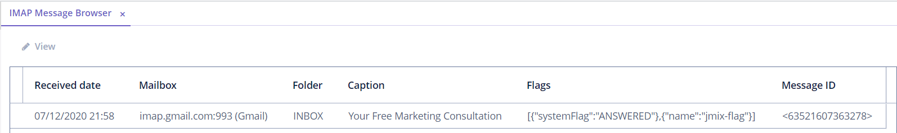

# Jmix IMAP

- [Overview](#overview)
- [Installation](#installation)
- [Add-on Configuration](#add-on-configuration)
- [Usage](#usage)
  - [Predefined Roles](#predefined-roles)
  - [Add-on Functionalities](#add-on-functionalities)
    - [IMAP Configuration](#imap-configuration)
    - [IMAP Message Browser](#imap-message-browser)
  - [Registering EventListeners to Interact with IMAP Events](#registering-eventlisteners-to-interact-with-imap-events)
  - [Creating Handlers for IMAP Events](#creating-handlers-for-imap-events)
  - [Using API](#using-api)
  - [Registering Custom IMAP Implementation Class](#registering-custom-imap-implementation-class)

# Overview

The IMAP-addon provides a readily available instrument for integrating email messaging into any Jmix-based application
via the IMAP protocol. The main model of the component is designed to interact with incoming emails via Spring application events.

The component includes the following set of functionalities:
* Integration between any IMAP servers and Jmix applications.
* Basic API methods to work with the main email server functionalities:
    * Connecting to servers;
    * Retrieving and viewing emails;
    * Searching for emails;
    * Operating custom flags.
* Predefined events for implementing custom business logic and processing various updates.
* User interface for configuring IMAP connection settings and events.


# Installation

Add to your project's `build.gradle` dependencies:

```groovy
implementation 'io.jmix.imap:jmix-imap-starter'
implementation 'io.jmix.imap:jmix-imap-ui-starter'
```

# Add-on Configuration

### Password Encryption
There is an ability to override default values of properties required to encrypt a password for a mailbox:

Open `application.properties` file of your application and configure the following application properties:

1. ```jmix.imap.encryption.key```
2. ```jmix.imap.encryption.iv```

### IMAP Messages Synchronization
There is a default scheduled task for the IMAP message synchronization. The implementation of the scheduled task is based on [Quartz Job Scheduler](https://www.quartz-scheduler.org/).
To use this task, add the dependency in the ```build.gradle```:
```groovy
implementation 'org.springframework.boot:spring-boot-starter-quartz'
```

There are the following properties to configure default scheduled task:
1. ```jmix.imap.useDefaultQuartzConfiguration``` - allows enable/disable task. Default value: ```true```.
2. ```jmix.imap.imapSyncCron``` - contains [CRON expression](http://www.quartz-scheduler.org/documentation/quartz-2.3.0/tutorials/crontrigger.html) for the task. 
   Default value: ```0 * * * * ?``` which means "every minute".
   
# Usage

## Predefined Roles

**IMAP Admin role** - allows user to configure IMAP events.

## Add-on Functionalities

### IMAP Configuration

*IMAP Configuration Browser* is designed to add and manage mailboxes from which emails are retrieved. The browser is
available from *Menu: Administration → IMAP → IMAP Configuration*.

Creating a new configuration is available by clicking the *Create* button.


#### IMAP Configuration Editor

*IMAP Configuration Editor* comprises two main sections to fill in: *Basic* and *Advanced*.


**Basic**

The *Basic* section enables to configure the main attributes for connecting to an email server via IMAP. The description of
all fields is provided below.

* *Name*: specify a name for connection.
* *Host*: specify a host name or IP address of an email server.
* *Port*: provide a port number to connect to an email server. The default value is *143*.
* *Secure Connection*: select an option for secure connection if required. Available values: *STARTTLS*, *SSL/TLS*.
* *Root Certificate*: upload a client certificate if required.
* *Username*: provide a username to connect to an email server.
* *Password*: provide a user password to connect to an email server.

The *Basic* section comprises the *Connect* button. After providing all required information, use the button to upload
a list of folders from the email server to work with.

**Advanced**

The *Advanced* section provides a set of additional options for connecting to an email server.

* *Custom Flag*: specify a custom flag to mark emails with when retrieving them from an email server.
* *Use trash folder to remove emails*: if checked, then it is possible to specify a trash folder of a current mailbox
(the *Trash Folder* field becomes available). The setting works as follows: if an email is moved to the specified folder on
the email server, `EmailDeletedImapEvent` occurs (for more details, see [Event Types](#event-types)).
* *Use custom event generator class*: if checked, it is possible to specify a custom class that defines additional logic
for connecting to an IMAP server, handling events, etc. If the current setting is enabled, the *Event Generator Class*
lookup field becomes available. To learn how to register a custom event generator class, please refer to
[Registering Custom IMAP Implementation Class](#registering-custom-imap-implementation-class).
* *Use proxy*: if checked, proxy settings become available (see the description below).

 **Proxy Configuration**

* *Proxy Host*: provide a host name or IP address of a proxy server.
* *Proxy Port*: provide a port to connect to a proxy server.
* *Use web proxy*: if checked, web proxy is used.

**Folders Configuration**

Once a connection to the provided email server is successfully established, the table of folders becomes available. The tables containing the events and their handlers become available as well. 


The table shows a list of folders from the email server you are connected to. In order to enable/disable some folders,
use the checkboxes in the "Enabled" column. If some folder is disabled, then messages from it are not retrieved.

For each folder you can enable/disable the IMAP events. There are two ways to enable/disable the IMAP events for the selected folder: 
1. Using the checkboxes in the "Enabled" column
2. Using the "Enable/Disable all events" action from the table actions list.
   
For each folder and for each event it is possible to register a custom logic by creating the custom event handlers.
(for more details, please refer to [Creating Handlers for IMAP Events](#creating-handlers-for-imap-events)).

### IMAP Message Browser

All emails from connected mailboxes are displayed in *IMAP Message Browser* (available from *Menu: Administration → IMAP → IMAP Message Browser*).



Selecting an email and clicking *View* opens it for reading. Email Screen contains all general details of an email:
date, author, subject, etc., and two tabs: *Body* and *Attachments*.

On the *Body* tab, the whole text of an email is displayed.

The *Attachments* tab comprises the table of attachments and the button to download required elements.


## Registering EventListeners to Interact with IMAP Events

There are two ways to register an event listener for the IMAP event.
1. You can register the `@Component` methods as Event listeners by using
the `@EventListener` annotation. The example of how to set up an event listener is provided below.

```java
import org.springframework.context.event.EventListener;

@Service(EmailReceiveService.NAME)
public class EmailReceiveServiceBean implements EmailReceiveService {

    @EventListener
    @Override
    public void receiveEmail(NewEmailImapEvent event) {
      // handles IMAP event
    }
}
```
In this case it is not required to add a handler for a particular folder and event in the IMAP Configuration Editor. 
The ```receiveEmail``` method will be automatically invoked after ```NewEmailImapEvent``` occurs.

2. Another option is to create `@Component` with a method having the required event type as the only parameter.

```java
@Component(EmailReceiver.NAME)
public class EmailReceiver {
    String NAME = "ceuia_EmailReceiver";

    public void receiveEmail(NewEmailImapEvent event) {
        // handle IMAP event
    }
}
```

Once it is done, the selected method (in the example, it is `receiveEmail`) should be registered on a particular folder and event type
for a given IMAP connection. This should be done at runtime using the IMAP configuration UI (see [Creating Handlers for
IMAP Events](#creating-handlers-for-imap-events)).
After that, the method will be invoked every time, when the configured event occurs.

## Creating Handlers for IMAP Events

After registering EventListeners, it is required to create handlers for IMAP events related to a particular folder and
mailbox (for more information see [IMAP Connection](#imap-configuration)). To configure the handlers for the IMAP event it is required:
1. Select a particular folder in the Folders table
2. Select a particular event in the Events table

After that the Handlers table is updated then there is an ability to add, remove and reorder handlers in the Handlers group.
The handlers added for a particular folder and event are invoked only if the folder and event are enabled.
### Event types

All events contain the `ImapMessage` object that can be used to determine where an event occurs (mailbox, folder, message).

The application component supports the following kinds of IMAP events:

* `NewEmailImapEvent` is triggered for a folder having an event of the `ImapEventType.NEW_EMAIL` type enabled,
when a new message appears in the folder on the IMAP server.
* `EmailSeenImapEvent` is triggered for a folder having an event of the `ImapEventType.EMAIL_SEEN` type enabled,
when a message is marked with the `jakarta.mail.Flags.Flag.SEEN` IMAP flag.
* `EmailAnsweredImapEvent` is triggered for a folder having an event of the `ImapEventType.NEW_ANSWER` type enabled,
when a message is replied (usually it happens when a message is marked with the `jakarta.mail.Flags.Flag.ANSWERED` IMAP flag).
* `EmailFlagChangedImapEvent` is triggered for a folder having an event of the `ImapEventType.FLAGS_UPDATED` type enabled,
when a standard or custom IMAP flag is changed for a message.
The event contains a `Map` of all changed flags and their actual state (set or unset).
* `EmailDeletedImapEvent` is triggered for a folder having an event of the `ImapEventType.EMAIL_DELETED` type enabled,
when a message is completely deleted from a folder on the IMAP server side, it is **not** related to the IMAP flag `jakarta.mail.Flags.Flag.DELETED`.
Such events are also triggered when a message is moved to a trash folder (if it is configured for a mailbox) on the server.
* `EmailMovedImapEvent` is triggered for a folder having an event of the `ImapEventType.EMAIL_MOVED` type enabled,
when a message is moved to another folder on the IMAP server.
**Note**: the standard implementation tracks only folders which are selected in the `ImapMailBox` configuration,
but does not count a trash folder, if one is configured.
* `NewThreadImapEvent` is not implemented yet.

## Using API

The component provides the following API to interact with the IMAP server:

* `ImapManager` methods:
    * `ImapConnectResult testConnection(ImapMailBox)` — check a connection for specified mail box.
    * `Collection<ImapFolderDto> fetchFolders(ImapMailBox)` — retrieves all folders preserving the tree structure.
    * `Collection<ImapFolderDto> fetchFolders(ImapMailBox, String...)` — retrieves folders with the specified names.
    The result is not structured as a tree.
    * `List<ImapFolderDto> fetchMessage(ImapMessage)` — fetches a single message using a reference.
    * `void moveMessage(ImapMessage, String)` — moves a message to a different folder on the IMAP server side.
    * `void deleteMessage(ImapMessage)` — deletes a message from a folder.
    * `void setFlag(ImapMessage, ImapFlag, boolean)` — sets or unsets a specified flag for a message.
* `ImapAttachments` methods:
    * `Collection<ImapMessageAttachment> fetchAttachments(ImapMessage)` — retrieves attachments included in a message.
    The result contains only meta data, no content.
    * `InputStream openStream(ImapMessageAttachment)` and `byte[] loadFile(ImapMessageAttachment` — retrieve the content
    of a message attachment.

## Registering Custom IMAP Implementation Class

In order to configure custom logic for a specific mailbox (e.g for applying IMAP extensions and custom communication
mechanisms), it is required to register a custom IMAP implementation class in the source code of your application.
The example of how to register such class is given below.

```java
@Component("imapsample_SimpleSingleFolderEventsGenerator")
public class SimpleSingleFolderEventsGenerator implements ImapEventsGenerator {
...
}
```

After registering a class implementing `ImapEventsGenerator`, it appears in the dropdown list of the *Event Generator Class*
field in *IMAP Configuration Editor* (for more details, see [IMAP Configuration Editor](#imap-configuration-editor)).


