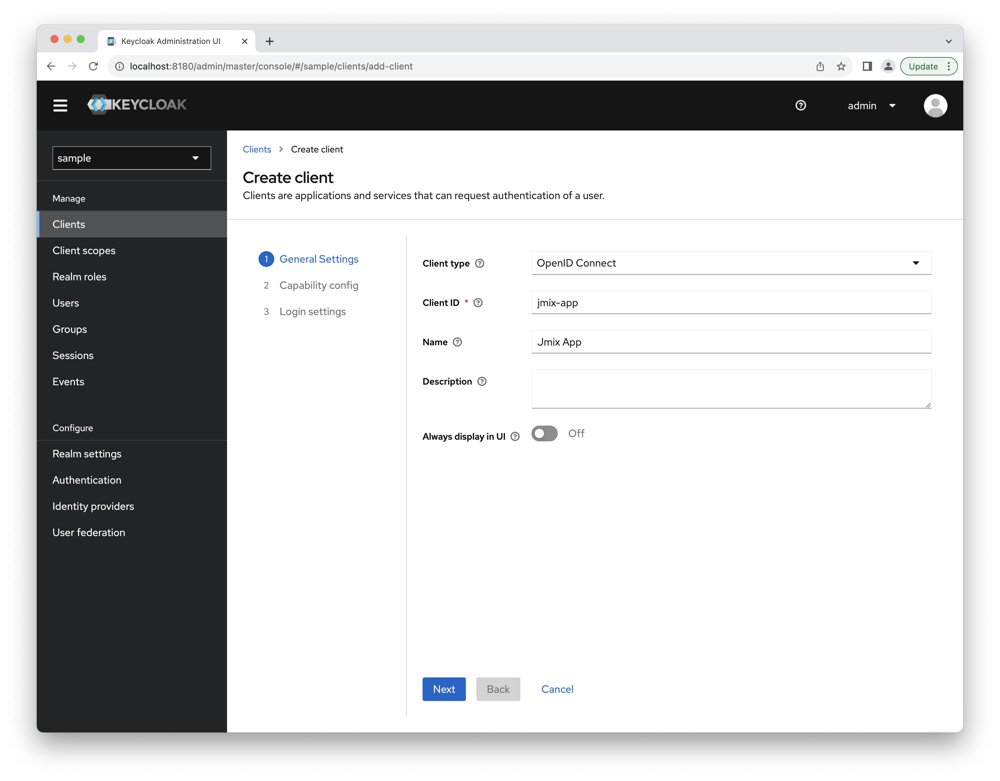
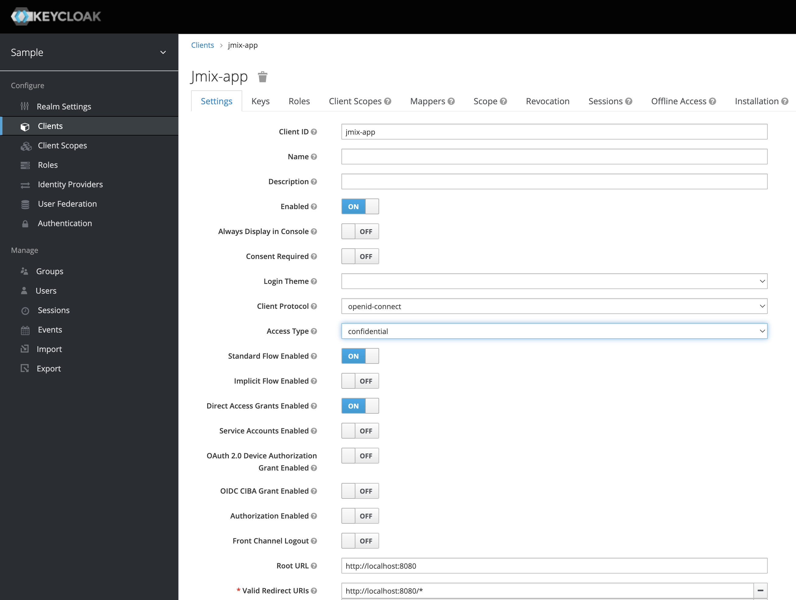
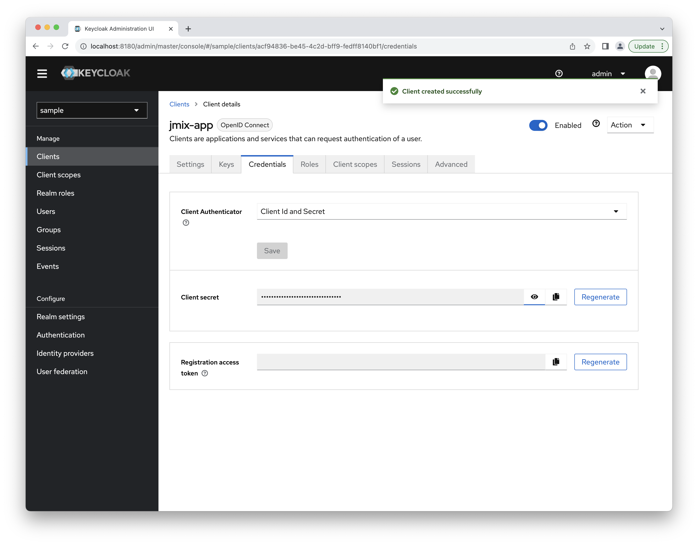
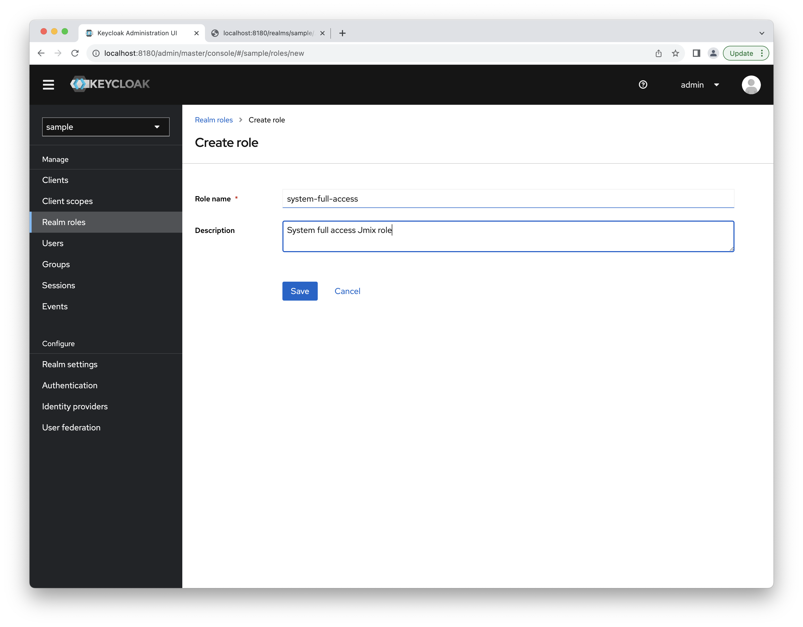
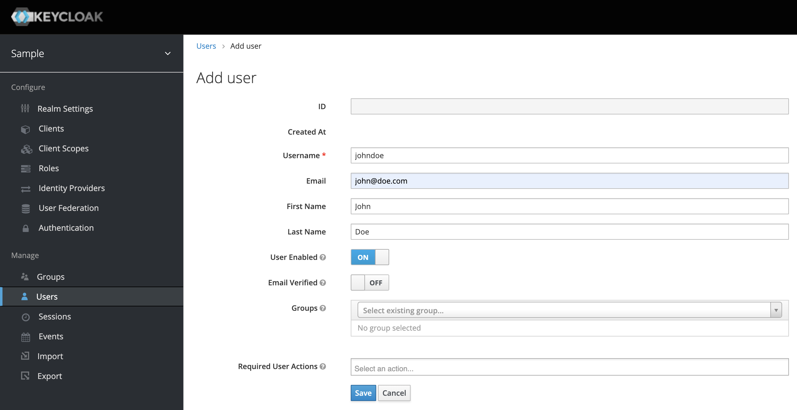
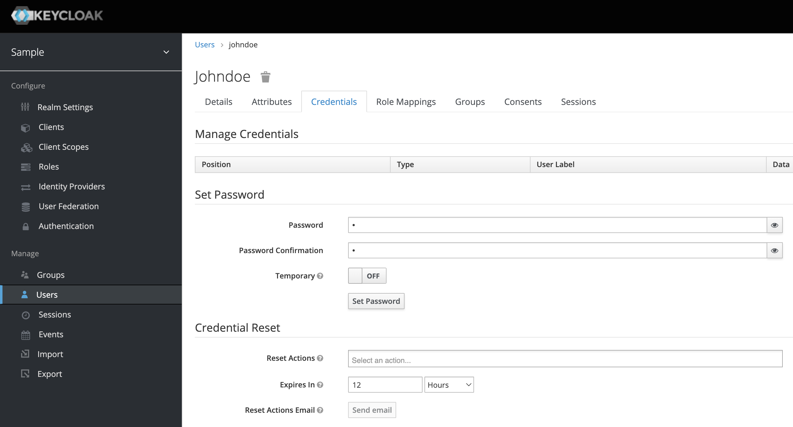

# Jmix OpenID Connect 

## Add-on Overview

The Jmix OpenID Connect add-on provides predefined Spring Security configurations and a set of services that will simplify the following operations:

* user authentication using an external OpenID Provider (e.g., Keycloak)
* mapping of user attributes and roles from OpenID Provider user to Jmix user
* persisting user entity and role assignments after the user is successfully authenticated at OpenID Provider

The add-on leverages Spring Security support for OAuth2 and OpenID Connect 1.0. You may read about it in [Spring Security documentation](https://docs.spring.io/spring-security/reference/servlet/oauth2/index.html).

If not explicitly disabled by setting the `jmix.oidc.use-default-configuration=false` application property, the `OidcAutoConfiguration`  will be applied by the add-on. The configuration enables OpenID Connect authentication for UI and REST API URLs.

## Adding Add-on to the Application

To include the jmix-oidc add-on to the application, add the following dependency to the `build.gradle`:

```
implementation 'io.jmix.oidc:jmix-oidc-starter'
```

## Client Configuration

Before starting the application the client must be configured. "Client" is Jmix application that requires end-user authentication from the OpenID Provider. Standard Spring Security client configuration is used. One of the ways to configure the client is to add the following properties to the `application.properties` file:

```properties
spring.security.oauth2.client.registration.keycloak.client-id=<client-id>
spring.security.oauth2.client.registration.keycloak.client-secret=<client-secret>
spring.security.oauth2.client.registration.keycloak.scope=openid, profile, email
spring.security.oauth2.client.provider.keycloak.issuer-uri=http://localhost:8180/auth/realms/<realm>
spring.security.oauth2.resourceserver.jwt.issuer-uri=http://localhost:8180/auth/realms/<realm>
```

"keycloak" in the property key is the provider id. It may have any value, e.g. `spring.security.oauth2.client.registration.okta.client-id`. Client ID and client secret values must be taken from the OpenID provider. The *issuer-uri* property contains a path to the OpenID Provider [Configuration Endpoint](https://openid.net/specs/openid-connect-discovery-1_0.html#ProviderConfig).

By default, the "sub" claim will be used as a Jmix user username. If you want to change it use the following application property:

```properties
spring.security.oauth2.client.provider.keycloak.user-name-attribute=preferred_username
```

## Using Default Add-on Configuration

After you added the dependency, set up the Keycloak and configured the client in `application.properties`, you may start the application. In this case, the default add-on configuration will do the following:

* Non-authenticated users will be redirected to OpenID Provider login page.
* After the user has authenticated in the OpenID Provider, an instance of `DefaultJmixOidcUser` will be created and set to the security context. No user attributes will be mapped. The user won't be stored in the database.
* Collection of user roles codes will be taken from the "roles" claim of the ID Token, then resource and row-level roles with given codes will be set to user authentication.

The `DefaultJmixOidcUser` class implements the `JmixOidcUser` interface. User class must always implement this interface because Jmix applications require the `UserDetails` interface, and Spring Security works with `OidcUser` interface. `JmixOidcUser` does nothing except implement both these interfaces.

## User Attributes and Roles Mapping

If you need to work with in-memory user, but want to fill some user attributes, then you need to create a class that extends the `DefaultJmixOidcUser`. For example, it will have a position attribute.

```java
import io.jmix.oidc.user.DefaultJmixOidcUser;

public class MyUser extends DefaultJmixOidcUser {

    private String position;

    public String getPosition() {
        return position;
    }

    public void setPosition(String position) {
        this.position = position;
    }
}
```

Then you need to register an instance of `OidcUserMapper` as Spring bean. You may extend the `BaseOidcUserMapper` and override its methods.

```java
import com.company.oidc1.user.MyUser;
import io.jmix.oidc.claimsmapper.ClaimsRolesMapper;
import io.jmix.oidc.usermapper.BaseOidcUserMapper;
import org.springframework.security.core.GrantedAuthority;
import org.springframework.security.oauth2.core.oidc.user.OidcUser;
import org.springframework.stereotype.Component;

import java.util.Collection;

@Component
public class MyOidcUserMapper extends BaseOidcUserMapper<MyUser> {

    private ClaimsRolesMapper claimsRolesMapper;

    public MyOidcUserMapper(ClaimsRolesMapper claimsRolesMapper) {
        this.claimsRolesMapper = claimsRolesMapper;
    }

    @Override
    protected MyUser initJmixUser(OidcUser oidcUser) {
        return new MyUser();
    }

    @Override
    protected void populateUserAttributes(OidcUser oidcUser, MyUser jmixUser) {
        jmixUser.setPosition((String) oidcUser.getClaims().get("position"));
    }

    @Override
    protected void populateUserAuthorities(OidcUser oidcUser, MyUser jmixUser) {
        Collection<? extends GrantedAuthority> authorities = claimsRolesMapper.toGrantedAuthorities(oidcUser.getClaims());
        jmixUser.setAuthorities(authorities);
    }
}
```

Note that in the example above, we delegate mapping claims from OIDC user to Jmix granted authorities to the instance of `ClaimsRolesMapper`. By default, the `DefaultClaimsRolesMapper` is used. `DefaultClaimsRolesMapper` gets the claim with the "roles" name from the ID Token. This claim must contain a collection of role names. Then for each role from the claim value resource role and row-level role are searched in Jmix. If found, corresponding granted authorities will be added to  the user. The roles claim name can be configured using in the `application.properties` file:

```properties
jmix.oidc.default-claims-roles-mapper.roles-claim-name=myRoles
```

If necessary, you may create your own claims to roles mapper. The easiest way to do it is to extend the `BaseClaimsRolesMapper` and override its `getResourceRolesCodes` or/and `getRowLevelRolesCodes` methods. The example below demonstrates how to assign roles based on the "position" claim.

```java
import io.jmix.oidc.claimsmapper.BaseClaimsRolesMapper;
import io.jmix.security.role.ResourceRoleRepository;
import io.jmix.security.role.RowLevelRoleRepository;
import org.springframework.stereotype.Component;

import java.util.Collection;
import java.util.HashSet;
import java.util.Map;

@Component
public class MyClaimsRoleMapper extends BaseClaimsRolesMapper {

    public MyClaimsRoleMapper(ResourceRoleRepository resourceRoleRepository,
                              RowLevelRoleRepository rowLevelRoleRepository) {
        super(resourceRoleRepository, rowLevelRoleRepository);
    }

    @Override
    protected Collection<String> getResourceRolesCodes(Map<String, Object> claims) {
        Collection<String> jmixRoleCodes = new HashSet<>();
        String position = (String) claims.get("position");
        if ("Manager".equals(position)) {
            jmixRoleCodes.add("edit-contracts");
            jmixRoleCodes.add("view-archive");
        } else {
            jmixRoleCodes.add("view-contracts");
        }
        return jmixRoleCodes;

    }
}
```

## Working with User JPA Entity

In order to work with jmix-oidc add-on, the `User` JPA entity must implement the `io.jmix.oidc.user.JmixOidcUser` interface that in turns implements `org.springframework.security.oauth2.core.oidc.user.OidcUser` required by Spring Security.

The simplest way to make the `User` entity compatible with jmix-oidc add-on is to make this class extend the `io.jmix.oidc.user.JmixOidcUserEntity` abstract class.

```java
@JmixEntity
@Entity
@Table(name = "USER_", indexes = {
        @Index(name = "IDX_USER__ON_USERNAME", columnList = "USERNAME", unique = true)
})
public class User extends JmixOidcUserEntity implements HasTimeZone {
    //...
}
```

To store users in the database after they are logged in using OpenID Provider you'll need to register a user mapper that extends the `SynchronizingOidcUserMapper` class. This superclass contains the behavior that stores/updates the user in the database. Optionally you may also store information about role assignments in the database.

```java
import com.company.oidc2.entity.User;
import io.jmix.core.UnconstrainedDataManager;
import io.jmix.core.security.UserRepository;
import io.jmix.oidc.claimsmapper.ClaimsRolesMapper;
import io.jmix.oidc.usermapper.SynchronizingOidcUserMapper;
import org.springframework.security.oauth2.core.oidc.user.OidcUser;
import org.springframework.stereotype.Component;

@Component
public class MySynchronizingOidcUserMapper extends SynchronizingOidcUserMapper<User> {

    public MySynchronizingOidcUserMapper(UnconstrainedDataManager dataManager,
                                         UserRepository userRepository,
                                         ClaimsRolesMapper claimsRolesMapper) {
        super(dataManager, userRepository, claimsRolesMapper);

        //store role assignments in the database (false by default)
        setSynchronizeRoleAssignments(true);
    }

    @Override
    protected Class<User> getApplicationUserClass() {
        return User.class;
    }

    @Override
    protected void populateUserAttributes(OidcUser oidcUser, User jmixUser) {
        jmixUser.setUsername(oidcUser.getName());
        jmixUser.setFirstName(oidcUser.getGivenName());
        jmixUser.setLastName(oidcUser.getFamilyName());
        jmixUser.setEmail(oidcUser.getEmail());
    }
}
```

## Protecting API

Jmix application may work as a resource server. To specify which authorization server to use, define the following application property:

```properties
spring.security.oauth2.resourceserver.jwt.issuer-uri=http://localhost:8180/auth/realms/<realm>
```

The value of the property is the URL contained in the `iss` claim for JWT tokens that the authorization server will issue. See Spring Security [documentation](https://docs.spring.io/spring-security/reference/servlet/oauth2/resource-server/jwt.html#_specifying_the_authorization_server) for details.

By default, the "sub" claim value is used as a username of Jmix user that is set to security context. If you want to change this, use the following application property:

```properties
jmix.oidc.jwt-authentication-converter.username-claim=preferred_username
```

In most cases the property value should be aligned with the value of the `spring.security.oauth2.client.provider.keycloak.user-name-attribute` property.

Access tokens obtained from OpenID Provider may be used for accessing protected endpoints provided by the REST API add-on.    

After installing the REST API add-on using the marketplace, two starters are added to the build.gradle:

```groovy
implementation("io.jmix.security:jmix-security-oauth2-starter")
implementation("io.jmix.rest:jmix-rest-starter")
```

If you are using an external OpenID Provider for issuing tokens, you don't longer need the `jmix-security-oauth2-starter`, and this dependency must be removed from the build.gradle.

```groovy
implementation("io.jmix.security:jmix-security-oauth2-starter")
```

For local keycloak instance access tokens may be obtained by in the following way:

```shell
curl -X POST http://localhost:8180/auth/realms/sample1/protocol/openid-connect/token \
--user <client-id>:<client-secret> \
-H "Content-Type: application/x-www-form-urlencoded" \
-d "grant_type=password&scope=openid&username=<username>&password=<password>"
```

For example:

```shell
curl -X POST http://localhost:8180/auth/realms/sample1/protocol/openid-connect/token \
--user jmix-app:UONXQZf6unxVuWsxXvhMAPv5IxFz5P7D \
-H "Content-Type: application/x-www-form-urlencoded" \
-d "grant_type=password&&scope=openid&username=johndoe&password=mypass"
```

Let's see how to protect custom MVC controllers. For example, you have the following controller in the application:

```java
import org.springframework.web.bind.annotation.GetMapping;
import org.springframework.web.bind.annotation.RestController;

@RestController
public class GreetingController {

    @GetMapping("/authenticated/hello")
    public String authenticatedHello() {
        return "authenticated-hello";
    }

    @GetMapping("/anonymous/hi")
    public String anonymousHello() {
        return "anonymous-hi";
    }
}
```

You want all URLs starting with `/authenticated/` to be protected and all URLs starting with `/anonymous/` to be available for anonymous access. To achieve this, in your application class or Spring configuration class, define a `AuthorizedUrlsProvider` bean:

```java
    @Bean
    public AuthorizedUrlsProvider myAuthorizedUrlsProvider() {
        return new AuthorizedUrlsProvider() {
            @Override
            public Collection<String> getAuthenticatedUrlPatterns() {
                return Arrays.asList("/authenticated/**");
            }

            @Override
            public Collection<String> getAnonymousUrlPatterns() {
                return Arrays.asList("/anonymous/**");
            }
        };
    }
```


## Application Properties

`jmix.oidc.use-default-configuration=true` - whether to apply default auto-configuration. True by default, set this property to false in case you want to have access to add-on beans and interfaces but don't want to use predefined Spring security configuration for protecting endpoints. In this case, you'll have to write your own security configuration. 

`jmix.oidc.default-claims-roles-mapper.roles-claim-name=roles` - name of the claim in ID Token that contains a collection of roles names. This property is used by `DefaultClaimsRolesMapper`.

## Configuring Local Keycloak Instance

One of the most popular OpenID Providers is Keycloak (https://www.keycloak.org/). To get familiar with the jmix-oidc add-on you may run Keycloak locally using Docker.

### Starting Keycloak Using Docker Compose

Use `docker-compose.yml` to launch Keycloak with Postgres database.

```dockerfile
version: '3'

volumes:
  postgres_data:
    driver: local

services:
  postgres:
    image: 'postgres:alpine'
    volumes:
      - ./postgres:/var/lib/postgresql/data
#    restart: 'always'
    ports:
      - 5432:5432
    environment:
      POSTGRES_USER: keycloak
      POSTGRES_PASSWORD: password
      POSTGRES_DB: keycloak
      POSTGRES_HOST: postgres

  keycloak:
    image: jboss/keycloak:16.1.0
    environment:
      DB_VENDOR: postgres
      DB_ADDR: postgres
      DB_PORT: 5432
      DB_DATABASE: keycloak
      DB_USER: keycloak
      DB_PASSWORD: password
      KEYCLOAK_USER: admin
      KEYCLOAK_PASSWORD: admin
      DEBUG: 'true'
      DEBUG_PORT: 5005
      JAVA_OPTS: -agentlib:jdwp=transport=dt_socket,server=y,suspend=n,address=*:5005
    volumes:
      - ./kk_data/data:/opt/jboss/keycloak/standalone/data
      - ./kk_data/export:/opt/jboss/keycloak/export-dir
      - ./kk_data/import:/opt/jboss/keycloak/import-dir
      - ./kk_data/deployments:/opt/jboss/keycloak/standalone/deployments
    ports:
      - 8180:8080
      - 5005:5005
    depends_on:
      - postgres
```

Run the command:

```
docker-compose up
```

Keycloak URL: http://localhost:8180/auth

Admin credentials:
```
Username: admin
Password: admin
```

You can read about configuring the Keycloak instance in the [Server Administration Guide](https://www.keycloak.org/docs/latest/server_admin/)

### Creating a Realm

Login to Keycloak admin console.

Point to the top of the left pane.

Click **Add Realm**.

Give a name to the new realm, e.g. "sample".


### Creating a Client

In order to connect a Jmix application to Keycloak, we need to create a new client **jmix-app** with the Client Protocol **openid-protocol**.



Set **Access Type** to `confidential` for the client.



After saving the new tab **Credentials** will appear. It displays **Client Secret**,
which we need to set up a connection in the Jmix project.



Client parameters should be used in the `application.properties` file. See the **Configuring Client** section.

### Creating a Role

Next we should create a new realm role. By default, the role name should match the Jmix role code. Let's create a **system-full-access** role.



### Creating a User

Let's create a user with **johndoe** username.



After the user is saved, the **Credentials** tab will appear. You may set the initial user password there.



In the **Role Mappings** tab assign the **system-full-access** role.


If you want to fill user attributes (e.g. "position") you can do that in **Attributes** tab in the user editor.

### Creating the Mapper

In order to return roles information in the ID Token we need to define a mapper for the **jmix-app** client. Open the client editor and switch to the **Mappers** tab. Create a new mapper there. The collection of role names will be returned in the "roles" claim.


